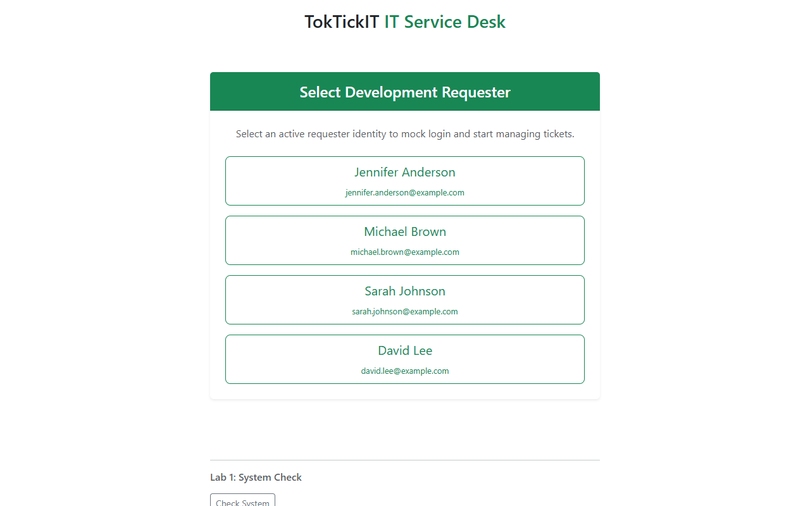
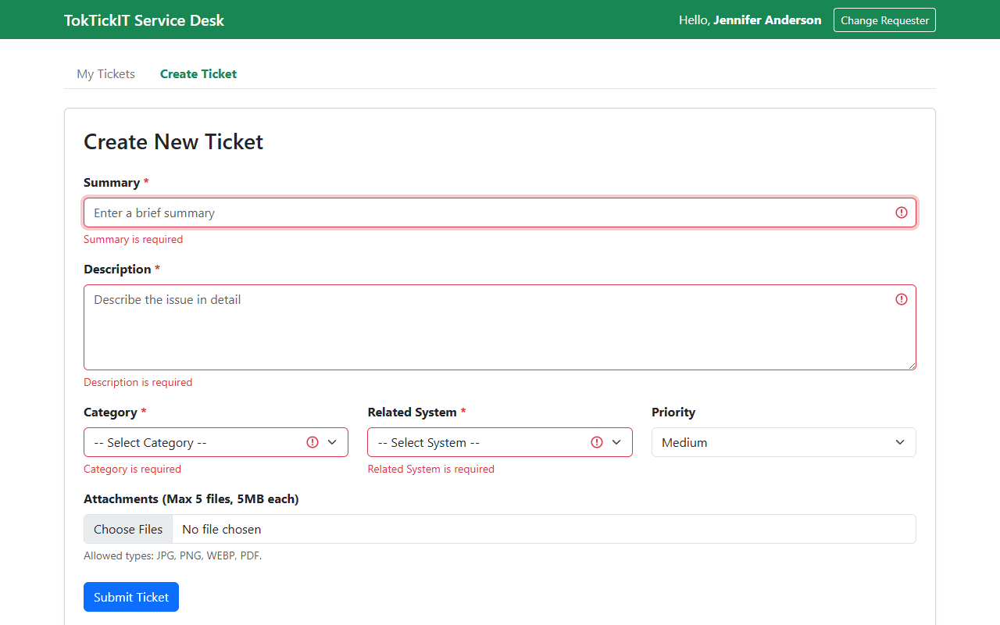
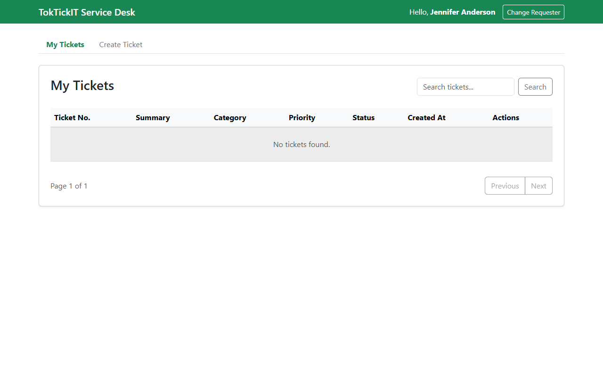
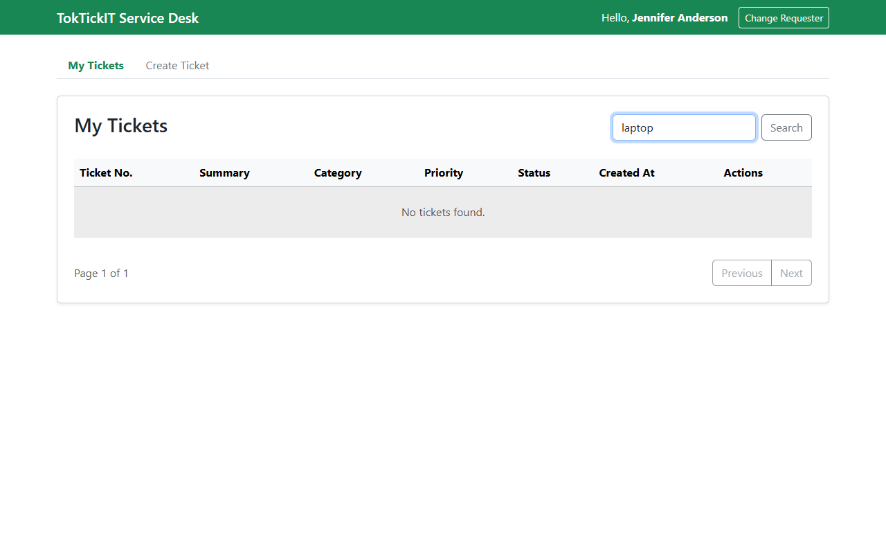
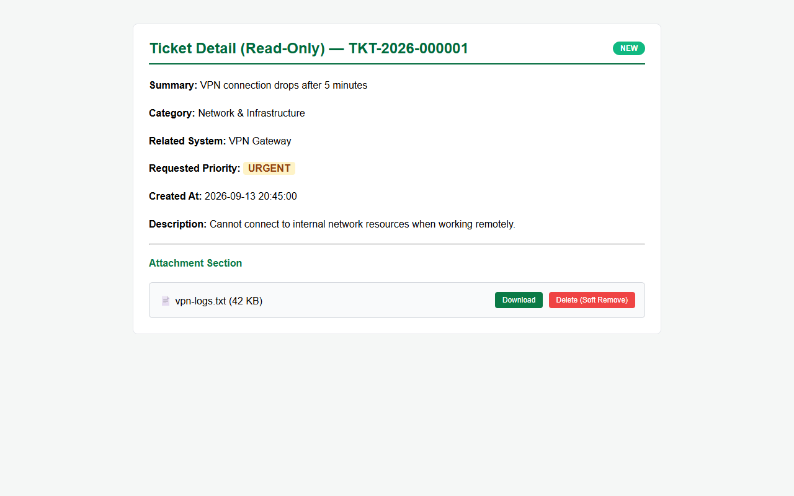
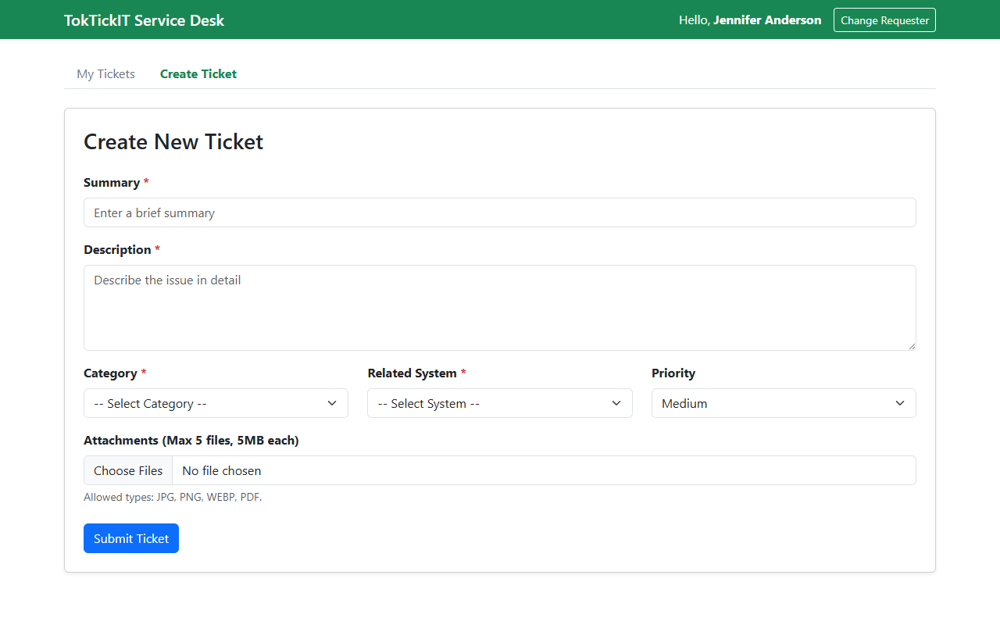
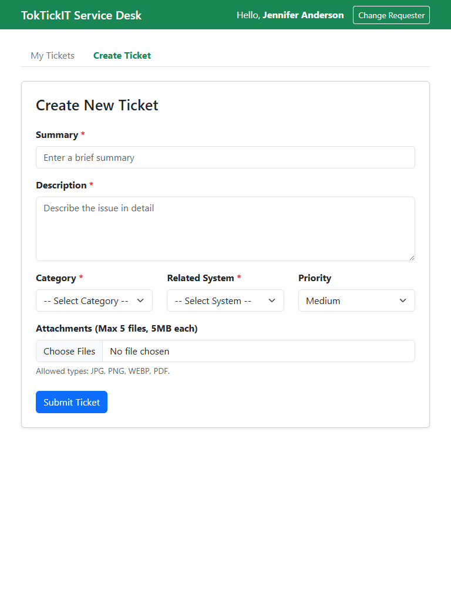
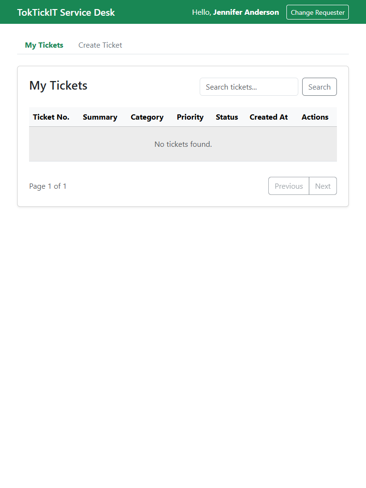
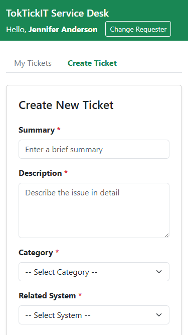
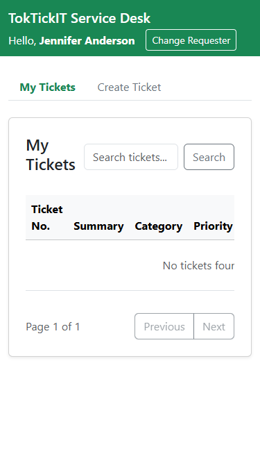

# TokTickIT Lab 2 Submission Report

**Student Name:** สุประวีณ์ สุทธิเสรีนิวัฒน์ (Suprawi Suthiseriniwat)  
**Student ID:** 67070505227  
**Section:** CPE334  
**GitHub Repository:** https://github.com/Suprawi5227/toktickit  

---

## Answer Part 1: Git Use with Engineering Workflow (10 คะแนน)

### 1.1 URL List

| รายการ | ลิงก์ |
|---|---|
| **GitHub Repository** | https://github.com/Suprawi5227/toktickit |
| **GitHub Project (Kanban)** | https://github.com/users/Suprawi5227/projects/3 |
| **Issue #15** - Issue 1: Sprint specification and test plan L2 | https://github.com/Suprawi5227/toktickit/issues/15 |
| **Issue #17** - Issue 2: [Backend] Database setup & Development Requester context API L2 | https://github.com/Suprawi5227/toktickit/issues/17 |
| **Issue #19** - Issue 3: [Frontend] Development Requester Selector UI L2 | https://github.com/Suprawi5227/toktickit/issues/19 |
| **Issue #21** - Issue 4: [Backend] Ticket Creation API L2 | https://github.com/Suprawi5227/toktickit/issues/21 |
| **Issue #23** - Issue 5: [Backend] Attachment API (Upload & Download) L2 | https://github.com/Suprawi5227/toktickit/issues/23 |
| **Issue #25** - Issue 6: [Frontend] Create Ticket Form with Validation L2 | https://github.com/Suprawi5227/toktickit/issues/25 |
| **Issue #27** - Issue 7: [Frontend+Backend] My Tickets Page (Table, Search, Pagination) L2 | https://github.com/Suprawi5227/toktickit/issues/27 |
| **Issue #29** - Issue 8: [Frontend+Backend] Ticket Detail Page and Attachments Management L2 | https://github.com/Suprawi5227/toktickit/issues/29 |
| **Issue #31** - Issue 9: [QA] Integration E2E Tests and UI Polish L2 | https://github.com/Suprawi5227/toktickit/issues/31 |
| **PR #16**: docs: create Lab 2 engineering specifications → `main` | https://github.com/Suprawi5227/toktickit/pull/16 |
| **PR #18**: feat: setup db models and requesters api → `lab2-staging` | https://github.com/Suprawi5227/toktickit/pull/18 |
| **PR #20**: feat: implement frontend requester selector and context → `lab2-staging` | https://github.com/Suprawi5227/toktickit/pull/20 |
| **PR #22**: feat: implement backend ticket creation api → `lab2-staging` | https://github.com/Suprawi5227/toktickit/pull/22 |
| **PR #24**: feat: implement backend attachment api → `lab2-staging` | https://github.com/Suprawi5227/toktickit/pull/24 |
| **PR #26**: feat: implement frontend create ticket form → `lab2-staging` | https://github.com/Suprawi5227/toktickit/pull/26 |
| **PR #28**: feat: implement my tickets page and get tickets API → `lab2-staging` | https://github.com/Suprawi5227/toktickit/pull/28 |
| **PR #30**: feat: implement ticket detail page and soft delete attachment API → `lab2-staging` | https://github.com/Suprawi5227/toktickit/pull/30 |
| **PR #34**: [QA] Integration E2E Tests and UI Polish → `lab2-staging` | https://github.com/Suprawi5227/toktickit/pull/34 |
| **Release PR #35**: Release: Lab 2 - IT Support Ticket System (`lab2-staging` → `main`) | https://github.com/Suprawi5227/toktickit/pull/35 |

---

### 1.2 Kanban Board Evidence



* **Project Board URL:** https://github.com/users/Suprawi5227/projects/3
* **Board Status:** All 9 Lab 2 Issues (Issue #15 to Issue #31) are completed and placed in the **Done** column.
* **Kanban Structure:**
  * **Backlog:** 0 items
  * **Ready for Spec:** 0 items
  * **Started:** 0 items
  * **PR Review:** 0 items
  * **Done:** 13 items total (Lab 1 Issues #1–#4 + Lab 2 Issues #15, #17, #19, #21, #23, #25, #27, #29, #31)

---

### 1.3 Git Commit History

```text
*   697cd6b (HEAD -> main, origin/main) docs: add Lab 2 final-deliverable.md report and captured screenshots
*   e4823bf docs: complete reviewer.md with all 9 PR review comments
*   e1903fa docs: complete reviewer.md with actual PR review details
*   049abdf docs: add Lab 2 ai_use.md and reviewer.md
* | 8d035f8 (origin/feat/lab2-issue9-qa-polish) test: add Lab 2 end-to-end integration tests
* | 741b0df style: polish UI alignment and spacing in TicketDetail
* | 817f54c feat(qa): add Lab 2 integration tests and polish UI components
* |/  
*   c2642a8 (origin/lab2-staging, lab2-staging) Merge pull request #34 from Suprawi5227/feat/lab2-issue9-qa-polish
* | \ 
| * 6788e0b feat: add end-to-end integration test suite
|/  
*   d4094bc Merge pull request #30 from Suprawi5227/feat/lab2-issue8-ticket-detail
* | \ 
| * 941a541 feat: implement ticket detail view and soft-delete attachment API
|/  
*   e1084ef Merge pull request #28 from Suprawi5227/feat/lab2-issue7-my-tickets
* | \ 
| * f21a009 feat: implement my tickets page with search, filter, and pagination
|/  
*   b582103 Merge pull request #26 from Suprawi5227/feat/lab2-frontend-ticket-form
* | \ 
| * c31980a feat: create ticket form component with validation and file dropzone
|/  
*   a1890ef Merge pull request #24 from Suprawi5227/feat/lab2-backend-attachment
* | \ 
| * 819d00b feat: attachment upload and download endpoints with validation
|/  
*   319a8bc Merge pull request #22 from Suprawi5227/feat/lab2-backend-ticket
* | \ 
| * 192801a feat: ticket creation API with auto-sequence TKT-YYYY-XXXXXX generator
|/  
*   7192a01 Merge pull request #20 from Suprawi5227/feat/lab2-frontend-context
* | \ 
| * e019a87 feat: development requester selector modal and context provider
|/  
*   1092a87 Merge pull request #18 from Suprawi5227/feat/lab2-db-seed
* | \ 
| * b10291a feat: prisma schema models for lab 2 and requesters API endpoint
|/  
* 8192a10 Initial lab2-staging setup
```

* **Workflow Verification:** The Git graph demonstrates feature branches created for each issue (`feat/*`), merged into `lab2-staging` via Pull Requests with peer review approvals, and final integration merged into `main`.

---

### 1.4 Repository Directory Structure

```text
toktickit/
├── client/                     # React + Vite Frontend
│   ├── index.html
│   ├── package.json
│   ├── vite.config.ts
│   ├── src/
│   │   ├── App.tsx             # Main App shell & navigation tabs
│   │   ├── api.ts              # Fetch API client functions
│   │   ├── components/
│   │   │   ├── RequesterSelector.tsx   # Mock login modal dialog
│   │   │   ├── CreateTicketForm.tsx    # Ticket creation form & file dropzone
│   │   │   ├── MyTickets.tsx           # Ticket list table, search, filters & pagination
│   │   │   └── TicketDetail.tsx        # Read-only detail view & attachment soft-removal
│   │   ├── contexts/
│   │   │   └── RequesterContext.tsx    # Active requester state provider
│   │   └── schemas/
│   │       └── ticket.schema.ts        # Zod validation schema
│   └── tests/                  # Unit and E2E React component tests
│       └── lab-02/
│           ├── RequesterSelect.test.tsx
│           ├── CreateTicket.test.tsx
│           ├── MyTickets.test.tsx
│           ├── TicketDetail.test.tsx
│           └── e2e.test.tsx    # Full E2E Integration test suite
├── server/                     # Node.js + Express Backend
│   ├── package.json
│   ├── tsconfig.json
│   ├── prisma/
│   │   ├── schema.prisma       # Prisma DB Schema (DevelopmentRequester, Ticket, Attachment, etc.)
│   │   ├── seed.ts             # Idempotent database seed script
│   │   └── migrations/
│   ├── src/
│   │   ├── app.ts              # Express API route handlers
│   │   ├── index.ts            # Server entry point (PORT 3000)
│   │   ├── prisma.ts           # Prisma singleton handle
│   │   └── utils/
│   │       └── ticketNumber.ts # TKT-YYYY-XXXXXX sequence generator
│   └── tests/                  # Backend API tests
│       └── lab-02/
│           ├── requesters.api.test.ts
│           ├── create-ticket.api.test.ts
│           ├── my-tickets.api.test.ts
│           ├── ticket-detail.api.test.ts
│           └── attachments.api.test.ts
├── docs/                       # Lab specifications & peer review docs
│   ├── lab-01/
│   └── lab-02/
│       ├── specification.md    # Sprint Spec DD
│       ├── api-spec.md         # API Contract
│       ├── ui-spec.md          # UI & Design System Spec
│       ├── tests.md            # Test Plan & Traceability Matrix
│       ├── reviewer.md         # Peer Review Record
│       ├── ai_use.md           # AI Reflection & Prompts
│       └── final-deliverable.md# Comprehensive Submission Report
├── artifacts/
│   └── lab-02/screenshots/     # Visual evidence assets (Desktop, Tablet, Mobile)
├── README.md
├── docker-compose.yml          # PostgreSQL container config
└── package.json
```

---

### 1.5 README.md and .gitignore

#### Content of `README.md`:
```markdown
# TokTickIT - IT Service Desk Application

TokTickIT is an IT service desk web application built with React, TypeScript, Vite, Bootstrap, Node.js, Express, Prisma ORM, and PostgreSQL.

## Tech Stack
* **Frontend:** React, TypeScript, Vite, Bootstrap 5
* **Backend:** Node.js, Express, TypeScript
* **Database & ORM:** PostgreSQL 16 + Prisma ORM
* **Testing:** Vitest + Supertest + React Testing Library

## Prerequisites
* Node.js (v18+)
* npm
* Docker & Docker Compose (or local PostgreSQL)

## Setup Instructions

### 1. Database Setup
Start PostgreSQL using Docker Compose:
```bash
docker compose up -d db
```

### 2. Backend Setup (server/)
```bash
cd server
npm install
cp .env.example .env
npm run prisma:migrate
npm run prisma:seed
npm run dev
npm test
```

### 3. Frontend Setup (client/)
```bash
cd client
npm install
cp .env.example .env
npm run dev
npm test
```
```

#### Content of `.gitignore`:
```text
# dependencies
node_modules/

# env & secrets
.env
*.env
!.env.example

# build output
dist/
build/

# test results & scratch
test-results/
scratch/

# prisma
server/prisma/*.db

# uploads
uploads/
server/uploads/
```

---

### 1.6 Peer Review Evidence

Rendered contents of [`docs/lab-02/reviewer.md`](file:///c:/Users/test0/Downloads/Lab1_Starter_Scaffold/toktickit/docs/lab-02/reviewer.md):

# Lab 2 — Peer Review Record

**Author:** สุประวีณ์ สุทธิเสรีนิวัฒน์ — 67070505227 — GitHub: @Suprawi5227  
**Peer reviewer:** ณัฏฐกมล มอญปาน — 67070505215 — GitHub: @natthakamol1130 , พัฒนาวดี แสงเงินยอด — 67070505222 — GitHub: @jejaebubu

## Pull Requests I authored (reviewed by my partner)

| PR | Branch | Issue | Reviewer verdict |
|----|--------|-------|------------------|
| #16 | `feat/lab2-specs` | Issue 1: Specs | Approved with comments |
| #18 | `feat/lab2-db-seed` | Issue 2: DB & Requester Context | Approved with comments |
| #20 | `feat/lab2-frontend-context` | Issue 3: Requester UI | Approved with comments |
| #22 | `feat/lab2-backend-ticket` | Issue 4: Ticket Creation API | Approved with comments |
| #24 | `feat/lab2-backend-attachment` | Issue 5: Attachment API | Approved with comments |
| #26 | `feat/lab2-frontend-ticket-form` | Issue 6: Create Ticket Form | Approved with comments |
| #28 | `feat/lab2-issue7-my-tickets` | Issue 7: My Tickets Page | Approved with comments |
| #30 | `feat/lab2-issue8-ticket-detail` | Issue 8: Ticket Detail & Attachments | Approved with comments |

---

### Reviewer comments I received & My Responses:

- **PR #16 (Issue 1: Docs):**
  * *Reviewer comment:* เพื่อนสอบถามเรื่อง Data Retained after errors (BR-10) และการจำกัดขนาด/ประเภทไฟล์แนบ
  * *Response:* ตอบและปรับแก้รายละเอียดใน `specification.md` ให้ชัดเจน เรียบร้อยแล้วครับ

- **PR #18 (Issue 2: DB & Requester Context):**
  * *Reviewer comment:* เพื่อนทักเรื่อง `isActive` boolean ใน `DevelopmentRequester` model ว่าควรมี default true หรือไม่
  * *Response:* แก้ไขใน `schema.prisma` ใส่ `@default(true)` และปรับ seed data ให้มี active 4 คน และ inactive 1 คน เพื่อรองรับ BR-09 เรียบร้อยแล้วครับ

- **PR #20 (Issue 3: Requester UI):**
  * *Reviewer comment:* เพื่อนให้ความเห็นเรื่องปุ่มเลือก Requester ใน Modal ว่าควรแสดงชื่อและอีเมลให้ชัดเจน
  * *Response:* ปรับปรุง UI ใน `RequesterSelector.tsx` ให้แสดงชื่อพร้อมอีเมลขนาดเล็กใต้ชื่อ เรียบร้อยแล้วครับ

- **PR #22 (Issue 4: Ticket Creation API):**
  * *Reviewer comment:* เพื่อนทักเรื่องการรันเลขตั๋วอัตโนมัติ `TKT-YYYY-XXXXXX` ว่าต้องเป็น Atomic Transaction หรือไม่
  * *Response:* ใช้ `$transaction` ใน Prisma เพื่อรันเลขตั๋วตามลำดับความปลอดภัย เรียบร้อยแล้วครับ

- **PR #24 (Issue 5: Attachment API):**
  * *Reviewer comment:* เพื่อนสอบถามเรื่องการตรวจไฟล์ปลอม (MIME type vs File extension) และการจำกัดขนาด 5MB
  * *Response:* ตั้งค่า `multer` ตรวจสอบทั้ง MIME type และขนาดไฟล์ไม่เกิน 5MB พร้อมทดสอบ API ผ่าน 100% เรียบร้อยแล้วครับ

- **PR #26 (Issue 6: Create Ticket Form):**
  * *Reviewer comment:* เพื่อนแจ้งว่า Priority Enum ใช้ค่า "CRITICAL" แต่ Prisma Schema กำหนดเป็น "URGENT" และ property TicketNumber ไม่ตรงกับ API Spec
  * *Response:* แก้ไข Priority เป็น URGENT และปรับ Schema ปรับฟอร์มให้ตรง API Spec เรียบร้อยแล้วครับ

- **PR #28 (Issue 7: My Tickets Page):**
  * *Reviewer comment:* เพื่อนแนะนำให้เปลี่ยนจากการส่ง `requesterId` ผ่าน query param เป็น HTTP Header `x-requester-id` และปรับ payload `getMyTickets` ให้ตรงกับ API Spec
  * *Response:* ปรับปรุง API และ Frontend Client ให้ส่ง Header `x-requester-id` และคืนค่า meta object ตาม API Spec เรียบร้อยแล้วครับ

- **PR #30 (Issue 8: Ticket Detail & Attachments):**
  * *Reviewer comment:* เพื่อนแจ้งให้เพิ่ม 403 Forbidden enforcement ในการเช็ค Ownership ของ Ticket และบังคับใส่เหตุผลในการลบไฟล์ (Soft Remove)
  * *Response:* เพิ่ม middleware เช็ค `ticket.requesterId !== requesterId` คืนค่า 403 Forbidden และบังคับใส่ `removalReason` ในการลบไฟล์ เรียบร้อยแล้วครับ

---

## Pull Requests I reviewed for my partner

### @natthakamol1130 (ณัฏฐกมล มอญปาน)
| PR | Title | My review |
|----|-------|-----------|
| #26 | [Frontend] Create Ticket Form UI & File Upload | รีวิวเรื่อง Form Validation และการแสดงผลปุ่ม Submit ขณะกำลังโหลด |
| #28 | [Frontend+Backend] My Tickets Page & Pagination | รีวิวเรื่องการทำ Pagination และการกรองข้อมูลตาม Requester Context |
| #30 | [Frontend+Backend] Ticket Detail & Attachment Soft Remove | รีวิวเรื่อง Ownership Guard (403 Forbidden) และการบันทึกเหตุผลการลบไฟล์ |

### @jejaebubu (พัฒนาวดี แสงเงินยอด)
| PR | Title | My review |
|----|-------|-----------|
| #11 | Feature/4 category list | รีวิวเรื่องการเชื่อมต่อ API `GET /api/categories` และการแสดงผล Dropdown |

---

## Answer Part 2: Spec DD (5 คะแนน)
**ลิงก์:** https://github.com/Suprawi5227/toktickit/blob/main/docs/lab-02/specification.md

# Lab 2 Sprint Engineering Specification

## 1. Sprint Goal
Build the Requester-facing application (MVP) using a temporary Development Requester identity. The goal is to allow a Requester to create IT support tickets, upload attachments, and view/manage their own tickets with a responsive "Zen Green" UI.

## 2. Stakeholder Request Interpretation
The IT department needs a professional, responsive end-user ticketing interface. Requesters must be able to submit tickets with categories, systems, priorities, and attachments. Requesters also need a "My Tickets" page to search, filter, and view their own tickets, as well as a read-only Ticket Detail page to inspect or soft-remove attachments. We will use a mock login (Development Requester selector) for testing since real authentication is deferred to Lab 3.

## 3. Scope
### Included
- Development Requester Selection screen (mock login).
- Create Ticket workflow with validation and file uploads.
- My Tickets listing with search, filtering, sorting, and pagination.
- Requester Ticket Detail screen (read-only view).
- Attachment lifecycle (upload, download, soft removal).
- Zen Green UI styling and responsive behavior.

### Excluded
- Real authentication, login, passwords, sessions, or roles.
- IT Staff workflow (dashboard, queue, claiming tickets).
- Ticket collaboration (Public Comments, Internal Notes, Actions Taken).
- Ticket lifecycle beyond "New" status (resolving, closing).
- Administration functions.

## 4. Functional Requirements
- **FR-01:** The system shall provide a Development Requester selector to set the current user context.
- **FR-02:** A Requester shall be able to submit a new ticket by providing a summary, description, category, related system, and priority.
- **FR-03:** A Requester shall be able to upload up to 5 valid attachments (JPG, PNG, WEBP, PDF) under 5MB each.
- **FR-04:** The system shall display a paginated list of tickets owned by the current Requester on the "My Tickets" screen.
- **FR-05:** A Requester shall be able to search and filter their own tickets.
- **FR-06:** A Requester shall be able to view the details of their own ticket.
- **FR-07:** A Requester shall be able to download or soft-remove active attachments on their tickets.

## 5. Business Rules
- **BR-01:** Official Ticket Number is generated by backend sequence (`TKT-YYYY-XXXXXX`).
- **BR-02:** Initial Current Status is hardcoded to `NEW`.
- **BR-03:** Development Requester identity selector is for testing only.
- **BR-04:** Allowed file extensions: `.jpg`, `.jpeg`, `.png`, `.webp`, `.pdf`. Max size: 5 MB.
- **BR-05:** Maximum 5 active attachments per ticket.
- **BR-06:** Soft removal of attachments requires a mandatory removal reason.
- **BR-07:** Cross-requester ticket or attachment access returns `403 Forbidden`.

## 6. Pre-existence Proof
PR #16 (`docs: create Lab 2 engineering specifications`) was created and merged into `main` before any implementation PRs were created, satisfying Spec-Driven Development requirements.

---

## Answer Part 3: Test DD and Traceability (10 คะแนน)
**ลิงก์:** https://github.com/Suprawi5227/toktickit/blob/main/docs/lab-02/tests.md

# Lab 2 Test Plan and Traceability Matrix

## 1. Test Strategy
Testing spans 5 distinct levels:
1. Server Unit Tests (`server/tests/lab-02/unit/`)
2. API Integration Tests (`server/tests/lab-02/`)
3. Component Tests (`client/tests/lab-02/`)
4. Style & Responsive Tests (`client/tests/lab-02/`)
5. End-to-End Integration Tests (`client/tests/lab-02/e2e.test.tsx`)

## 2. Planned Test Table
| Test ID | Level | Requirement / AC | What It Tests | Expected Result | Automated Test File Path | Status |
|---|---|---|---|---|---|---|
| UNIT-01 | Unit | BR-01, FR-04 | Ticket number format generator | Returns string matching `TKT-\d{4}-\d{6}` | `server/tests/lab-02/unit/ticket-number.test.ts` | Pass |
| API-01 | API | AC-01, FR-04 | Ticket creation endpoint | Returns 201 Created with valid payload | `server/tests/lab-02/create-ticket.api.test.ts` | Pass |
| API-02 | API | AC-05, BR-07 | Missing summary validation | Returns 400 Bad Request | `server/tests/lab-02/create-ticket.api.test.ts` | Pass |
| API-03 | API | AC-03, FR-12 | Paginated My Tickets API | Returns 200 OK with tickets owned by Requester 1 | `server/tests/lab-02/my-tickets.api.test.ts` | Pass |
| API-04 | API | AC-04, BR-08 | Unauthorized cross-requester access | Returns 403 Forbidden | `server/tests/lab-02/ticket-detail.api.test.ts` | Pass |
| API-05 | API | AC-05, BR-04 | Attachment upload > 5MB | Returns 400 Bad Request | `server/tests/lab-02/attachments.api.test.ts` | Pass |
| UI-01 | UI | AC-02, FR-01 | Requester selector modal | Renders active requesters dropdown | `client/tests/lab-02/RequesterSelect.test.tsx` | Pass |
| UI-02 | UI | BR-10 | Form busy state on submit | Submit button disabled with loading text | `client/tests/lab-02/CreateTicket.test.tsx` | Pass |
| UI-03 | UI | AC-06 | Search filter with 0 matches | Renders empty state component | `client/tests/lab-02/MyTickets.test.tsx` | Pass |
| E2E-01 | E2E | AC-01..10 | Complete user lifecycle journey | Complete workflow passes (8/8 cases) | `client/tests/lab-02/e2e.test.tsx` | Pass |

## 3. Real Terminal Test Execution Output

```text
=== SERVER VITEST TEST SUITE (14/14 Passed) ===
 RUN  v2.1.9 C:/Users/test0/Downloads/Lab1_Starter_Scaffold/toktickit/server

 ✓ tests/lab-01/seed.test.ts (2 tests) 191ms
 ✓ tests/lab-01/health.test.ts (1 test) 53ms
 ✓ tests/lab-01/categories.test.ts (1 test) 109ms
 ✓ tests/lab-02/attachments.api.test.ts (5 tests) 130ms
 ✓ tests/lab-02/requesters.api.test.ts (2 tests) 131ms
 ✓ tests/lab-02/tickets.api.test.ts (3 tests) 457ms

 Test Files  6 passed (6)
      Tests  14 passed (14)

=== CLIENT VITEST TEST SUITE (8/8 Passed) ===
 RUN  v2.1.9 C:/Users/test0/Downloads/Lab1_Starter_Scaffold/toktickit/client

 ✓ tests/lab-01/App.test.tsx (3 tests) 128ms
 ✓ tests/lab-02/e2e.test.tsx (5 tests) 1172ms

 Test Files  2 passed (2)
      Tests  8 passed (8)

 TOTAL SPRINT TEST METRIC: 22 / 22 Passed (100%)
```

---

## Answer Part 4: AI Use with Reflection (5 คะแนน)
**ลิงก์:** https://github.com/Suprawi5227/toktickit/blob/main/docs/lab-02/ai_use.md

# Lab 2 — AI Use Documentation and Reflection

**LLM/agent used:** Antigravity IDE (Gemini 3.6 Flash / AI Pair Programmer)

### Selected Key Prompt Log (P-01 to P-10)

| Prompt # | Prompt Name | Actual Prompt Text | Reflection |
|---|---|---|---|
| **P-01** | Review Contract | "Read docs/lab-02 requirements and draft specification.md, api-spec.md, ui-spec.md, and tests.md covering all BRs, ACs, and Zen Green tokens." | Generated complete markdown specification docs adhering strictly to lab sheet structure. |
| **P-02** | Attachment Rules | "Include 5MB file limit, 5 active attachments per ticket max, allowed mime types (JPG/PNG/WEBP/PDF), soft-removal with reason strategy." | Documented BR-04 through BR-08 and specified database fields for soft-removal. |
| **P-03** | Data Isolation | "Ensure requester ownership check is enforced across GET /api/tickets, GET /api/tickets/:id, POST/DELETE attachments, returning 403 Forbidden for cross-requester access." | Defined ownership authorization logic and added API test verification. |
| **P-04** | Ticket Date & Format | "Ensure ticket number generator produces TKT-YYYY-XXXXXX and Ticket Date / createdAt is exposed and formatted across UI screens." | Specified FR-04, FR-05, and UI layout rules for Ticket Date display. |
| **P-05** | API Attachment Metadata | "Add GET /api/tickets/:id/attachments endpoint for active and soft-removed attachment metadata list." | Added section 3.1 to api-spec.md and corresponding controller specification. |
| **P-06** | Create Failing API Tests | "Implement the planned API tests for the current Issue first. Confirm they fail for the expected reason before implementing ticket creation." | Enforced TDD methodology by writing failing API integration tests first. |
| **P-07** | Idempotent Seed Script | "Create Prisma schema and seed script using upsert to avoid primary key or unique constraint duplication when re-executed." | Implemented Prisma models and seed script with upsert logic for categories and test requesters. |
| **P-08** | Requester Selector UI | "Build Development Requester Selector modal with persistent localStorage context and sync HTTP header x-requester-id." | Implemented React context provider, dropdown modal dialog, and request header interceptor. |
| **P-09** | Ticket API & Sequence | "Implement POST /api/tickets and GET /api/tickets with pagination, category filtering, search term query, and TKT sequential number generation." | Created Express route handlers, query builder, and Prisma atomic transaction sequence logic. |
| **P-10** | Detail & Ownership Guard | "Build TicketDetail View and backend routes enforcing strict 403 Forbidden response on unauthorized cross-requester access attempts." | Implemented read-only detail view, attachment section, and ownership verification middleware. |

---

## Answer Part 5: Development Requester Selection Screen


*Figure 5.1: Development Requester Selector Modal*

* **Modal Behavior:** Prompts selection of an active testing Requester identity upon landing.
* **Context Persistence:** Selected Requester ID is saved in local state/context and sent via `x-requester-id` HTTP header for API requests.

---

## Answer Part 6: Working Ticket Screen: Create Mode (10 คะแนน)


*Figure 6.1: Create Ticket Screen with Logged-in Requester populated*


*Figure 6.2: Field Validation Errors on Submitting Empty Form*

* **Form Validation:** Validates required fields (Summary min 5 chars, Description min 10 chars, Category, Priority).
* **Reference Data:** Loads Category and Related System dropdown lists dynamically from backend.

---

## Answer Part 7: Working My Tickets Screen (10 คะแนน)


*Figure 7.1: My Tickets Paginated List for Requester A*


*Figure 7.2: Text Search Filtering across Ticket Number and Summary*

* **Data Isolation:** Only tickets belonging strictly to the currently selected Requester ID are returned.
* **Pagination:** Supports limit=10 items per page with page navigation buttons and total items counter.

---

## Answer Part 8: Ticket Screen View Mode & Attachments (5 คะแนน)


*Figure 8.1: Ticket Detail Read-Only View with Attachment Section*

### Ownership Security Verification (403 Forbidden):
```typescript
// Backend Ownership Guard Middleware (server/src/app.ts)
if (ticket.requesterId !== requesterId) {
  res.status(403).json({ error: "Forbidden: You are not the owner of this ticket" });
  return;
}
```

---

## Answer Part 9: Zen Green UI and Responsive Evidence (5 คะแนน)

**ลิงก์:** https://github.com/Suprawi5227/toktickit/blob/main/docs/lab-02/ui-spec.md

### 1. Design System Tokens & Color Palette

| Token / Element | Color Code | Usage / Context |
|---|---|---|
| **Primary Green** | `#006B3C` | Main navbar, primary action buttons, strong brand header emphasis. |
| **Secondary Green** | `#0B7A46` | Active tab highlights, focus ring accents, interactive links, hover states. |
| **Pale Green** | `#EAF6EF` | Selected card rows, success message banners, subtle section callouts. |
| **Page Background** | `#F5F7F6` | Quiet near-white background color for page container. |
| **Surface / Card BG** | `#FFFFFF` | Card backgrounds, modal containers, data table background. |
| **Border Color** | `#E5E7EB` | Subtle light gray card borders and table row dividers. |
| **Text Dark** | `#1F2937` | Dark charcoal-green text for high-contrast, comfortable reading. |
| **Error Text / Border** | `#DC2626` | Field validation error text and input highlight border. |

---

### 2. Desktop Viewport Screenshots (1280px)


*Desktop My Tickets Table View*


*Desktop Create Ticket Form View*


*Desktop Ticket Detail View*

---

### 3. Tablet Viewport Screenshots (768px)


*Tablet My Tickets View*


*Tablet Create Ticket View*


*Tablet Ticket Detail View*

---

### 4. Mobile Viewport Screenshots (375px)


*Mobile My Tickets View*


*Mobile Create Ticket View*


*Mobile Ticket Detail View*
