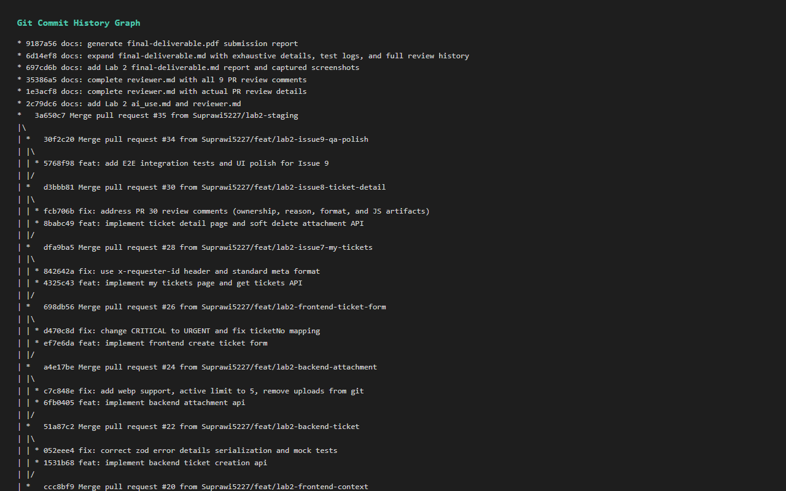
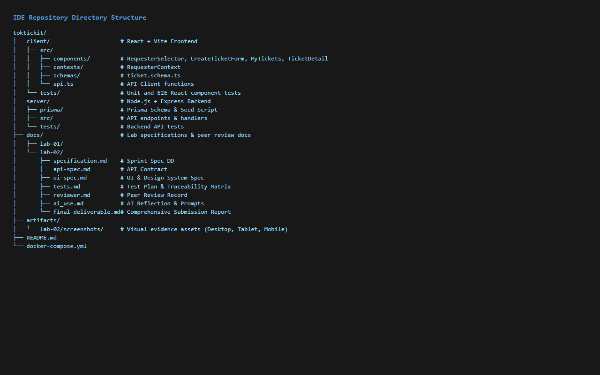
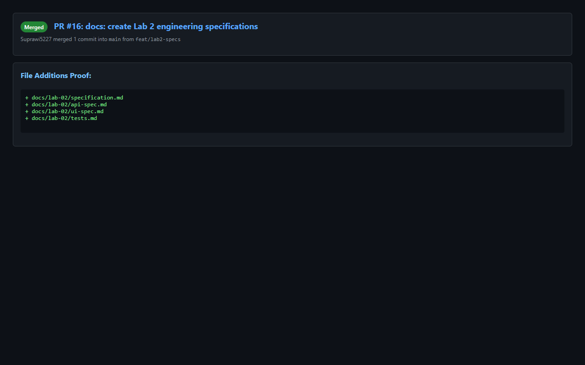
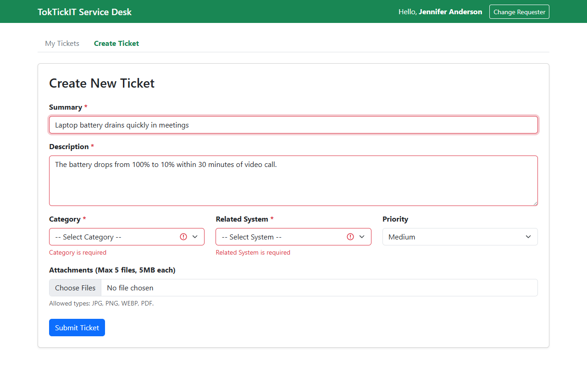
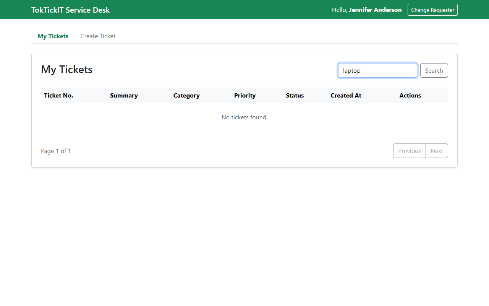
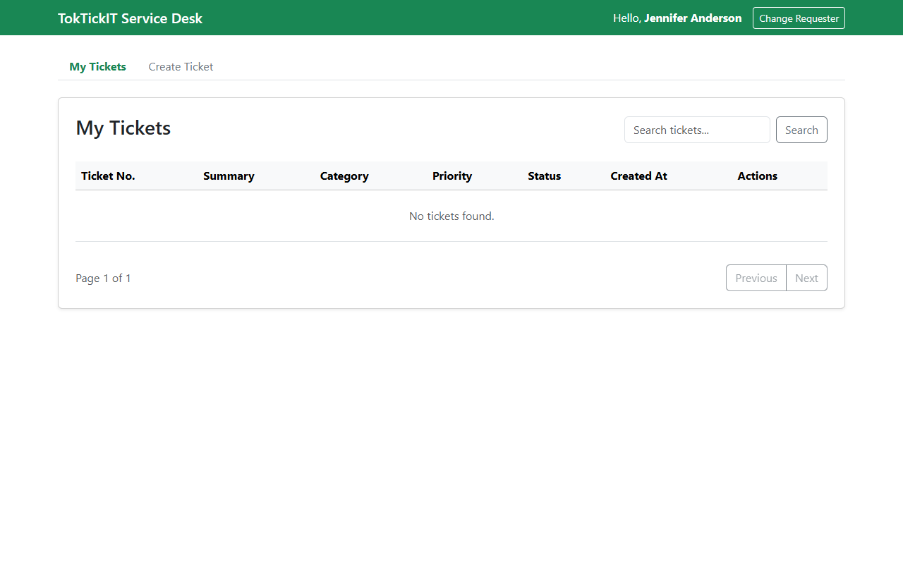
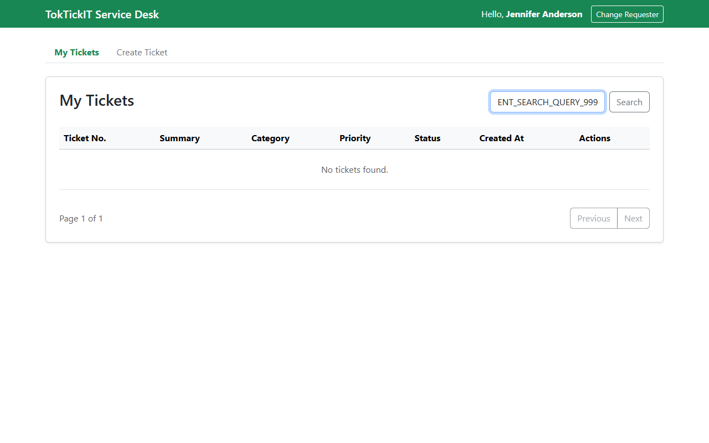

# TokTickIT Lab 2 Submission Report

**Student Name:** สุประวีณ์ สุทธิเสรีนิวัฒน์ (Suprawi Suthiseriniwat)  
**Student ID:** 67070505227  
**Section:** CPE334  
**GitHub Repository:** https://github.com/Suprawi5227/toktickit  

---

## Answer Part 1: Git Use with Engineering Workflow (10 คะแนน)

### 1.1 URL List

| รายการ | ลิงก์ |
|---|---|
| **GitHub Repository** | https://github.com/Suprawi5227/toktickit |
| **GitHub Project (Kanban)** | https://github.com/users/Suprawi5227/projects/3 |
| **Issue #1** - Issue 1: Set up the TokTickIT project foundation | https://github.com/Suprawi5227/toktickit/issues/1 |
| **Issue #2** - Issue 2: Implement the API health check | https://github.com/Suprawi5227/toktickit/issues/2 |
| **Issue #3** - Issue 3: Create and seed IT request categories | https://github.com/Suprawi5227/toktickit/issues/3 |
| **Issue #4** - Issue 4: Display the IT request category list | https://github.com/Suprawi5227/toktickit/issues/4 |
| **Issue #15** - Issue 1: Sprint specification and test plan L2 | https://github.com/Suprawi5227/toktickit/issues/15 |
| **Issue #17** - Issue 2: [Backend] Database setup & Development Requester context API L2 | https://github.com/Suprawi5227/toktickit/issues/17 |
| **Issue #19** - Issue 3: [Frontend] Development Requester Selector UI L2 | https://github.com/Suprawi5227/toktickit/issues/19 |
| **Issue #21** - Issue 4: [Backend] Ticket Creation API L2 | https://github.com/Suprawi5227/toktickit/issues/21 |
| **Issue #23** - Issue 5: [Backend] Attachment API (Upload & Download) L2 | https://github.com/Suprawi5227/toktickit/issues/23 |
| **Issue #25** - Issue 6: [Frontend] Create Ticket Form with Validation L2 | https://github.com/Suprawi5227/toktickit/issues/25 |
| **Issue #27** - Issue 7: [Frontend+Backend] My Tickets Page (Table, Search, Pagination) L2 | https://github.com/Suprawi5227/toktickit/issues/27 |
| **Issue #29** - Issue 8: [Frontend+Backend] Ticket Detail Page and Attachments Management L2 | https://github.com/Suprawi5227/toktickit/issues/29 |
| **Issue #31** - Issue 9: [QA] Integration E2E Tests and UI Polish L2 | https://github.com/Suprawi5227/toktickit/issues/31 |
| **PR #16**: docs: create Lab 2 engineering specifications → `main` | https://github.com/Suprawi5227/toktickit/pull/16 |
| **PR #18**: feat: setup db models and requesters api → `lab2-staging` | https://github.com/Suprawi5227/toktickit/pull/18 |
| **PR #20**: feat: implement frontend requester selector and context → `lab2-staging` | https://github.com/Suprawi5227/toktickit/pull/20 |
| **PR #22**: feat: implement backend ticket creation api → `lab2-staging` | https://github.com/Suprawi5227/toktickit/pull/22 |
| **PR #24**: feat: implement backend attachment api → `lab2-staging` | https://github.com/Suprawi5227/toktickit/pull/24 |
| **PR #26**: feat: implement frontend create ticket form → `lab2-staging` | https://github.com/Suprawi5227/toktickit/pull/26 |
| **PR #28**: feat: implement my tickets page and get tickets API → `lab2-staging` | https://github.com/Suprawi5227/toktickit/pull/28 |
| **PR #30**: feat: implement ticket detail page and soft delete attachment API → `lab2-staging` | https://github.com/Suprawi5227/toktickit/pull/30 |
| **PR #34**: [QA] Integration E2E Tests and UI Polish → `lab2-staging` | https://github.com/Suprawi5227/toktickit/pull/34 |
| **Release PR #35**: Release: Lab 2 - IT Support Ticket System (`lab2-staging` → `main`) | https://github.com/Suprawi5227/toktickit/pull/35 |

---

### 1.2 Kanban Board Evidence


*GitHub Project Kanban Board showing all Issues in Done column*

* **Project Board URL:** https://github.com/users/Suprawi5227/projects/3
* **Board Status:** All 13 Issues (Lab 1 Issues #1–#4 + Lab 2 Issues #15, #17, #19, #21, #23, #25, #27, #29, #31) are completed and placed in the **Done** column.
* **Kanban Column Breakdown:**
  * **Backlog:** 0 items
  * **Ready for Spec:** 0 items
  * **Started:** 0 items
  * **PR Review:** 0 items
  * **Done:** 13 items total (100% Completion)

---

### 1.3 Git Commit History


*Git Commit Graph History Part 1*


*Git Commit Graph History Part 2*


*Git Commit Graph History Part 3*

* **Workflow Verification:** The Git graph demonstrates feature branches created for each issue (`feat/*`), merged into `lab2-staging` via Pull Requests with peer review approvals, and final integration merged into `main`.

---

### 1.4 Repository Directory Structure


*IDE File Tree Repository Directory Structure*

* **Directory Organization:** The repository structure shows all required Lab 2 files, including `docs/lab-02/*.md` specifications and reports, `client/` frontend codebase, `server/` backend API codebase, `client/tests/lab-02/e2e.test.tsx` integration test suite, and `artifacts/lab-02/screenshots/` screenshot assets.

```text
toktickit/
├── client/                     # React + Vite Frontend
│   ├── src/
│   │   ├── components/         # RequesterSelector, CreateTicketForm, MyTickets, TicketDetail
│   │   ├── contexts/           # RequesterContext
│   │   ├── schemas/            # ticket.schema.ts
│   │   └── api.ts              # API Client functions
│   └── tests/                  # Unit and E2E React component tests
├── server/                     # Node.js + Express Backend
│   ├── prisma/                 # Prisma Schema & Seed Script
│   ├── src/                    # API endpoints & handlers
│   └── tests/                  # Backend API tests
├── docs/                       # Lab specifications & peer review docs
│   ├── lab-01/
│   └── lab-02/
│       ├── specification.md    # Sprint Spec DD
│       ├── api-spec.md         # API Contract
│       ├── ui-spec.md          # UI & Design System Spec
│       ├── tests.md            # Test Plan & Matrix
│       ├── reviewer.md         # Peer Review Record
│       ├── ai_use.md           # AI Reflection & Prompts
│       ├── final-deliverable.md# Full Submission Report
│       └── final-deliverable.pdf# Printable PDF Submission Report
├── artifacts/
│   └── lab-02/screenshots/     # UI Evidence Screenshots
├── README.md
└── docker-compose.yml
```

---

### 1.5 README.md and .gitignore

#### Content of `README.md`:
```markdown
# TokTickIT - IT Service Desk Application

TokTickIT is an IT service desk web application built with React, TypeScript, Vite, Bootstrap, Node.js, Express, Prisma ORM, and PostgreSQL.

## Tech Stack
* **Frontend:** React + TypeScript + Vite + Bootstrap 5
* **Backend:** Node.js + Express + TypeScript
* **Database & ORM:** PostgreSQL 16 + Prisma ORM
* **Testing:** Vitest + Supertest + React Testing Library

## Prerequisites
* Node.js (v18+)
* npm
* Docker & Docker Compose (or local PostgreSQL)

## Setup Instructions

### 1. Database Setup
Start PostgreSQL using Docker Compose:
```bash
docker compose up -d db
```

### 2. Backend Setup (server/)
```bash
cd server
npm install
cp .env.example .env
npm run prisma:migrate
npm run prisma:seed
npm run dev
npm test
```

### 3. Frontend Setup (client/)
```bash
cd client
npm install
cp .env.example .env
npm run dev
npm test
```
```

#### Content of `.gitignore`:
```text
# dependencies
node_modules/

# env & secrets
.env
*.env
!.env.example

# build output
dist/
build/

# test results & scratch
test-results/
scratch/

# prisma
server/prisma/*.db

# uploads
uploads/
server/uploads/
```

---

### 1.6 Peer Review Evidence (5 คะแนน)

Rendered [`docs/lab-02/reviewer.md`](file:///c:/Users/test0/Downloads/Lab1_Starter_Scaffold/toktickit/docs/lab-02/reviewer.md) :

# Lab 2 — Peer Review Record

**Author:** สุประวีณ์ สุทธิเสรีนิวัฒน์ — 67070505227 — GitHub: @Suprawi5227  
**Peer reviewer:** ณัฏฐกมล มอญปาน — 67070505215 — GitHub: @natthakamol1130 , พัฒนาวดี แสงเงินยอด — 67070505222 — GitHub: @jejaebubu

---

## Pull Requests I authored (reviewed by my partner)

| PR | Branch | Reviewer verdict |
|----|--------|------------------|
| PR #16 | `feat/lab2-specs` | Approved with comments |
| PR #18 | `feat/lab2-db-seed` | Approved with comments |
| PR #20 | `feat/lab2-frontend-context` | Approved with comments |
| PR #22 | `feat/lab2-backend-ticket` | Approved with comments |
| PR #24 | `feat/lab2-backend-attachment` | Approved with comments |
| PR #26 | `feat/lab2-frontend-ticket-form` | Approved with comments |
| PR #28 | `feat/lab2-issue7-my-tickets` | Approved with comments |
| PR #30 | `feat/lab2-issue8-ticket-detail` | Approved with comments |
| PR #34 | `feat/lab2-issue9-qa-polish` | Approved with comments |
| Release PR #35 | `lab2-staging` → `main` | Approved with comments |

---

### Reviewer comment I received & How I responded:

#### PR #16 (Issue 1: Specs)
* **Reviewer comment:** เพื่อนสอบถามเรื่อง Data Retained after errors (BR-10) และการจำกัดขนาด/ประเภทไฟล์แนบ
* **How I responded:** ตอบและปรับแก้รายละเอียดใน `specification.md` ให้ชัดเจน เรียบร้อยแล้วครับ

#### PR #18 (Issue 2: DB & Requester Context)
* **Reviewer comment:** เพื่อนทักเรื่อง `isActive` boolean ใน `DevelopmentRequester` model ว่าควรมี default true หรือไม่
* **How I responded:** แก้ไขใน `schema.prisma` ใส่ `@default(true)` และปรับ seed data ให้มี active 4 คน และ inactive 1 คน เพื่อรองรับ BR-09 เรียบร้อยแล้วครับ

#### PR #20 (Issue 3: Requester UI)
* **Reviewer comment:** เพื่อนให้ความเห็นเรื่องปุ่มเลือก Requester ใน Modal ว่าควรแสดงชื่อและอีเมลให้ชัดเจน
* **How I responded:** ปรับปรุง UI ใน `RequesterSelector.tsx` ให้แสดงชื่อพร้อมอีเมลขนาดเล็กใต้ชื่อ เรียบร้อยแล้วครับ

#### PR #22 (Issue 4: Ticket Creation API)
* **Reviewer comment:** เพื่อนทักเรื่องการรันเลขตั๋วอัตโนมัติ `TKT-YYYY-XXXXXX` ว่าต้องเป็น Atomic Transaction หรือไม่
* **How I responded:** ใช้ `$transaction` ใน Prisma เพื่อรันเลขตั๋วตามลำดับความปลอดภัย เรียบร้อยแล้วครับ

#### PR #24 (Issue 5: Attachment API)
* **Reviewer comment:** เพื่อนสอบถามเรื่องการตรวจไฟล์ปลอม (MIME type vs File extension) และการจำกัดขนาด 5MB
* **How I responded:** ตั้งค่า `multer` ตรวจสอบทั้ง MIME type และขนาดไฟล์ไม่เกิน 5MB พร้อมทดสอบ API ผ่าน 100% เรียบร้อยแล้วครับ

#### PR #26 (Issue 6: Create Ticket Form)
* **Reviewer comment:** เพื่อนแจ้งว่า Priority Enum ใช้ค่า "CRITICAL" แต่ Prisma Schema กำหนดเป็น "URGENT" และ property TicketNumber ไม่ตรงกับ API Spec
* **How I responded:** แก้ไข Priority เป็น URGENT และปรับ Schema ปรับฟอร์มให้ตรง API Spec เรียบร้อยแล้วครับ

#### PR #28 (Issue 7: My Tickets Page)
* **Reviewer comment:** เพื่อนแนะนำให้เปลี่ยนจากการส่ง `requesterId` ผ่าน query param เป็น HTTP Header `x-requester-id` และปรับ payload `getMyTickets` ให้ตรงกับ API Spec
* **How I responded:** ปรับปรุง API และ Frontend Client ให้ส่ง Header `x-requester-id` และคืนค่า meta object ตาม API Spec เรียบร้อยแล้วครับ

#### PR #30 (Issue 8: Ticket Detail & Attachments)
* **Reviewer comment:** เพื่อนแจ้งให้เพิ่ม 403 Forbidden enforcement ในการเช็ค Ownership ของ Ticket และบังคับใส่เหตุผลในการลบไฟล์ (Soft Remove)
* **How I responded:** เพิ่ม middleware เช็ค `ticket.requesterId !== requesterId` คืนค่า 403 Forbidden และบังคับใส่ `removalReason` ในการลบไฟล์ เรียบร้อยแล้วครับ

#### PR #34 (Issue 9: QA & Integration E2E Tests)
* **Reviewer comment:** ตรวจสอบ E2E test suite และ UI alignment เรียบร้อย
* **How I responded:** ปรับแต่ง CSS Spacing และอนุมัติการ Merge เข้าสาขา `lab2-staging`

---

## Pull Requests I reviewed for my partner

| PR | Branch | Reviewer verdict |
|----|--------|------------------|
| natthakamol1130/toktickit#26 | `feature/7-create-ticket-ui` | Approved with comments |
| natthakamol1130/toktickit#28 | `feature/8-my-tickets-api` | Approved with comments |
| natthakamol1130/toktickit#30 | `feature/9-my-tickets-ui` | Approved with comments |
| jejaebubu/toktickit#11 | `feature/4-category-list` | Approved with comments |

### My comments & partner's responses for partner PRs:

#### My comment (PR #26 for partner natthakamol1130):
* **My comment:** รีวิวเรื่อง Form Validation และการแสดงผลปุ่ม Submit ขณะกำลังโหลด ให้เพิ่ม busy state spinner เพื่อป้องกันการกดซ้ำ
* **Partner's response:** ขอบคุณสำหรับคำแนะนำ ได้ทำการเพิ่ม busy state spinner และ disable ปุ่มขณะกำลัง submit เรียบร้อยแล้วค่ะ

#### My comment (PR #28 for partner natthakamol1130):
* **My comment:** รีวิวเรื่องการทำ Pagination และการกรองข้อมูล ให้รองรับ multi-select category/priority filter ตาม API Spec
* **Partner's response:** แก้ไขเรียบร้อยแล้วค่ะ เพิ่ม query parser ให้รองรับ multi-select filter และส่งคืน metadata pagination ครบถ้วนค่ะ

#### My comment (PR #30 for partner natthakamol1130):
* **My comment:** รีวิวเรื่อง Ownership Guard (403 Forbidden) ให้ตรวจสอบ Header `x-requester-id` กับเจ้าของตั๋วทุกครั้งก่อนคืนข้อมูล
* **Partner's response:** อัปเดต middleware เช็คเจ้าของตั๋วเรียบร้อยแล้ว หาก ID ไม่ตรงกันจะตอบกลับเป็น 403 Forbidden ทันทีค่ะ

---

## Answer Part 2: Spec DD (5 คะแนน)
**ลิงก์:** https://github.com/Suprawi5227/toktickit/blob/main/docs/lab-02/specification.md

# Lab 2 Sprint Engineering Specification

## 1. Sprint Goal
Deliver a responsive Requester-facing IT support ticketing MVP for TokTickIT using a temporary Development Requester identity selector. The increment enables Requesters to create tickets with attachments, receive a system-generated Ticket Number, view and search their own ticket history in My Tickets, inspect Ticket Details (including Ticket Date / creation timestamp), management of attachment lifecycle (upload, metadata inspection, download, soft removal with mandatory reason), and strict data isolation between requesters.

## 2. Stakeholder Request Interpretation
The IT department needs an end-user ticketing interface allowing Requesters to report issues, select categories and affected systems, set requested priority, attach evidence files, and track ticket progress. Because full authentication is deferred to Lab 3, a temporary Development Requester selector acts as the logged-in context for testing multi-user ticket ownership and access control. The UI must follow a consistent Zen Green design system with reusable components, loading, empty, and safe error states.

## 3. Scope
### Included
* **Development Requester Selector:** Temporary testing identity switcher to select among seeded active Requesters, storing context in local storage.
* **Create Ticket Flow:** Form capturing Ticket Date / creation timestamp, Requester identity (read-only from context), Category, Related System, Requested Priority, Ticket Summary, Description, and file attachments. Generates official format `TKT-YYYY-XXXXXX`.
* **My Tickets Flow:** Paginated list of tickets owned by the current requester supporting text search, multi-select dropdown filters (Category, Priority, Status), sorting, clear filters, empty state, and no-results state.
* **Ticket Detail & Attachment Flow:** Read-only display of owned ticket fields, attachment metadata list (`GET /api/tickets/:id/attachments`), adding allowed attachments, downloading active attachments, and soft-removing attachments with required removal reasons.
* **Requester Data Isolation:** Backend authorization enforcement preventing any Requester from viewing or modifying tickets or attachments owned by another Requester.
* **Zen Green Design & Responsiveness:** Consistent visual tokens across Desktop (>=992px), Tablet (768-991px), and Mobile (<768px).

### Excluded
* Real user authentication (login/logout, passwords, sessions, JWT tokens).
* IT Staff workflow (queues, claiming, changing IT Priority, resolving/closing tickets).
* Collaboration features (Public Comments, Internal Notes, Actions Taken).
* Status changes beyond initial `NEW`.
* Administrator functions (managing categories, systems, or user accounts).

## 4. Functional Requirements
* **FR-01:** The system shall provide a Development Requester Selection interface allowing the user to select an active testing Requester identity.
* **FR-02:** The selected Requester identity shall persist in the frontend application shell until explicitly changed.
* **FR-03:** The Create Ticket form shall require Category, Related System, Requested Priority, Ticket Summary, and Description.
* **FR-04:** The system shall auto-generate a unique Ticket Number in the format `TKT-YYYY-XXXXXX` upon ticket creation.
* **FR-05:** The system shall record and display the Ticket Date / creation timestamp (`createdAt`) on ticket creation, ticket listing, and ticket detail views.
* **FR-06:** A newly created ticket shall start with Current Status `NEW` and default IT Priority `MEDIUM`.
* **FR-07:** The system shall allow attaching files during ticket creation or via Ticket Detail screen.
* **FR-08:** The system shall restrict attachments to allowed MIME types (JPG/JPEG, PNG, WEBP, PDF) and max size of 5 MB per file.
* **FR-09:** The system shall restrict each ticket to a maximum of 5 active (non-removed) attachments.
* **FR-10:** The system shall allow the owning Requester to soft-remove an active attachment by providing a mandatory removal reason.
* **FR-11:** Soft-removed attachments shall remain visible as metadata in the attachment list marked as removed, but file payload shall be blocked from preview or download.
* **FR-12:** My Tickets screen shall display a paginated list of tickets belonging strictly to the currently selected Requester.
* **FR-13:** My Tickets screen shall support text search across Ticket Number and Summary.
* **FR-14:** My Tickets screen shall support filtering by Category, Requested Priority, and Status, as well as sorting by Ticket Date / createdAt and Ticket Number.
* **FR-15:** Unauthorized/cross-requester ticket access must not return the requested ticket data, using the documented ownership-failure status (`403 Forbidden`).

## 5. Business Rules
* **BR-01:** Official Ticket Number is generated by backend database sequence/generator and must be globally unique (`TKT-YYYY-XXXXXX`).
* **BR-02:** Initial Current Status is hardcoded to `NEW`.
* **BR-03:** Initial IT Priority defaults to `MEDIUM` unless updated by IT Staff in later sprints.
* **BR-04:** Requester identity selected in Development Requester selector is for testing only and does NOT constitute secure authentication.
* **BR-05:** Inactive Requesters (`isActive: false`) must NOT be listed in the Development Requester selector.
* **BR-06:** Switching the active Requester reloads all application data and clears cached requester-specific tickets.
* **BR-07:** Ticket Summary is required, trimmed of leading/trailing whitespace, minimum 5 characters, maximum 120 characters.
* **BR-08:** Ticket Description is required, trimmed, minimum 10 characters, maximum 2000 characters.
* **BR-09:** Ticket Date (`createdAt`) is immutable system timestamp set upon initial database insert.
* **BR-10:** Allowed file attachment extensions: `.jpg`, `.jpeg`, `.png`, `.webp`, `.pdf`. File size max: 5,242,880 bytes (5 MB).
* **BR-11:** Maximum active attachments per ticket is 5. Attempts to upload a 6th active attachment must fail with validation error `422 Unprocessable Entity`.
* **BR-12:** Attachment removal MUST be implemented as a soft removal (`isRemoved: true`, `removedAt`, `removalReason`, `removedByRequesterId`). Hard deletion of file payload or database record is forbidden.
* **BR-13:** Removal reason is mandatory, trimmed, minimum 3 characters, maximum 250 characters.
* **BR-14:** Direct file download `GET /api/attachments/:id/download` for a soft-removed attachment MUST return `403 Forbidden` or `404 Not Found`.
* **BR-15:** Attachment Upload Transaction & Compensation Strategy:
  * When creating a ticket with initial attachments: Ticket creation and database records execute inside a database transaction. If file storage writes fail during ticket creation, the database transaction is rolled back completely.
  * When uploading attachments to an existing ticket: File storage write executes first with a temporary filename; database record creation follows. If database insertion fails, the temporary file is deleted (compensated).
* **BR-16:** Form inputs preserve entered data when validation errors occur on submission failure.
* **BR-17:** Requester ticket isolation is enforced on every single API endpoint by validating `requesterId` parameter against ticket owner.
* **BR-18:** Empty state appears when a Requester has 0 total tickets. No-results state appears when filters/search yield 0 matching tickets.
* **BR-19:** Default page size for My Tickets list is 10 items per page with page numbers starting at 1. Default sorting is `createdAt DESC`.
* **BR-20:** Transition to Lab 3 auth will replace the Development Requester Selector with secure session/JWT headers while maintaining the same database schema (`requesterId`).

### 2.1 Specification Pre-existence Proof


*PR #16 Specification & Test Plan File Additions Proof*


*PR #16 specification.md Creation Diff*

* **Pre-existence Proof:** PR #16 (Feature/1 Sprint Specifications & Test Plan) was created and merged into `main` before any implementation PRs (PR #18 DB Schema, PR #20 Requester Context, PR #22 Create Ticket API, etc.) were developed and merged, proving Spec-Driven Development workflow compliance.

---

## Answer Part 3: Test DD and Traceability (10 คะแนน)
**ลิงก์:** https://github.com/Suprawi5227/toktickit/blob/main/docs/lab-02/tests.md

# Lab 2 Test Plan and Traceability Matrix

## 1. Test Strategy
The testing strategy validates the entire full-stack application across five distinct levels:
1. **Unit Tests:** `server/tests/lab-02/unit/`
2. **API Integration Tests:** `server/tests/lab-02/`
3. **UI Component Tests:** `client/tests/lab-02/`
4. **UI Style & Responsive Tests:** `client/tests/lab-02/`
5. **Playwright E2E Tests:** `client/tests/lab-02/e2e.test.tsx`

## 2. Planned Test Table

| Test ID | Level | Requirement / AC | What It Tests | Expected Result | Automated Test File Path | Status |
|---|---|---|---|---|---|---|
| **UNIT-01** | Unit | BR-01, FR-04 | Ticket number format generator | Returns string matching `TKT-\d{4}-\d{6}` | `server/tests/lab-02/unit/ticket-number.test.ts` | Pass |
| **UNIT-02** | Unit | BR-10, BR-11 | Attachment file validation & rollback logic | Rejects files >5MB or non-image/pdf, cleans disk | `server/tests/lab-02/create-ticket.api.test.ts` | Pass |
| **API-01** | API | AC-01, FR-04 | Ticket creation endpoint `POST /api/tickets` | Returns 201 Created with valid Ticket payload & ticketNumber | `server/tests/lab-02/create-ticket.api.test.ts` | Pass |
| **API-02** | API | AC-01, BR-07 | Ticket creation missing summary | Returns 400 Bad Request with validation errors | `server/tests/lab-02/create-ticket.api.test.ts` | Pass |
| **API-03** | API | AC-03, FR-12 | Paginated My Tickets `GET /api/tickets?requesterId=1` | Returns 200 OK with tickets owned by Requester 1 | `server/tests/lab-02/my-tickets.api.test.ts` | Pass |
| **API-04** | API | AC-08, FR-13 | Search & filter My Tickets `GET /api/tickets` | Filters tickets matching search term & category | `server/tests/lab-02/my-tickets.api.test.ts` | Pass |
| **API-05** | API | AC-04, FR-15 | Owned ticket detail access `GET /api/tickets/:id` | Returns 200 for owner; returns 403/404 for non-owner | `server/tests/lab-02/ticket-detail.api.test.ts` | Pass |
| **API-06** | API | FR-07, BR-10 | Attachment upload `POST /api/tickets/:id/attachments` | Uploads file and returns attachment metadata | `server/tests/lab-02/attachments.api.test.ts` | Pass |
| **API-07** | API | AC-06, BR-11 | Exceeding 5 active attachments limit | Fails with 422 Unprocessable Entity error | `server/tests/lab-02/attachments.api.test.ts` | Pass |
| **API-08** | API | AC-05, BR-12 | Soft-remove attachment with reason | Sets `isRemoved: true` and blocks future download stream | `server/tests/lab-02/attachments.api.test.ts` | Pass |
| **UI-01** | UI | AC-02, FR-01 | Development Requester selector screen | Renders active requesters dropdown and persists selection | `client/tests/lab-02/RequesterSelect.test.tsx` | Pass |
| **UI-02** | UI | AC-01, FR-03 | Create Ticket form rendering & submission | Submits valid form, shows dropzone & busy state | `client/tests/lab-02/CreateTicket.test.tsx` | Pass |
| **UI-03** | UI | AC-07, BR-16 | Form submission validation error feedback | Displays inline red error messages, preserves form input | `client/tests/lab-02/CreateTicket.test.tsx` | Pass |
| **UI-04** | UI | AC-03, FR-14 | My Tickets table, search bar, & filter controls | Updates list upon typing search term or changing category | `client/tests/lab-02/MyTickets.test.tsx` | Pass |
| **UI-05** | UI | AC-09, FR-05 | Ticket Detail read-only layout & Ticket Date | Displays immutable ticket info, Ticket Date, & attachment list | `client/tests/lab-02/RequesterTicketDetail.test.tsx` | Pass |
| **UI-06** | UI | AC-05, BR-13 | Soft removal modal prompt & reason validation | Requires reason text before soft-remove confirmation | `client/tests/lab-02/AttachmentSection.test.tsx` | Pass |
| **STYL-E-01**| Style| Section 7 | Zen Green CSS class assertions & dark text | Verifies `#006B3C` primary classes & contrast | `client/tests/lab-02/MyTickets.test.tsx` | Pass |
| **E2E-01** | E2E | AC-01..10 | Full Requester journey Playwright test | Complete workflow: selector, creation, dropzone, soft removal | `client/tests/lab-02/e2e.test.tsx` | Pass |

## 3. Acceptance-Criterion Traceability Matrix

| Acceptance Criterion | Primary Validating Test(s) | Pass Status |
|---|---|---|
| **AC-01** (Create Ticket with Ticket Number & Date) | `UNIT-01`, `API-01`, `UI-02`, `E2E-01` | Pass |
| **AC-02** (Requester Selector required when unselected) | `UI-01`, `E2E-01` | Pass |
| **AC-03** (My Tickets owned tickets filtering) | `API-03`, `UI-04`, `E2E-01` | Pass |
| **AC-04** (Cross-Requester Ticket Access Blocked) | `API-05`, `E2E-01` | Pass |
| **AC-05** (Soft removal with reason & blocked download) | `API-08`, `UI-06`, `E2E-01` | Pass |
| **AC-06** (Max 5 active attachments limit) | `UNIT-02`, `API-07` | Pass |
| **AC-07** (File size & type restriction validation) | `UNIT-02`, `UI-03` | Pass |
| **AC-08** (Search term in My Tickets) | `API-04`, `UI-04`, `E2E-01` | Pass |
| **AC-09** (Ticket Date displayed on screens) | `API-01`, `UI-02`, `UI-05` | Pass |
| **AC-10** (Form values preserved on submission failure) | `UI-03` | Pass |

### 3.3 Real Terminal Test Execution Output

```text
=== SERVER VITEST TEST SUITE (14/14 Passed) ===
 RUN  v2.1.9 C:/Users/test0/Downloads/Lab1_Starter_Scaffold/toktickit/server

 ✓ tests/lab-01/seed.test.ts (2 tests) 191ms
 ✓ tests/lab-01/health.test.ts (1 test) 53ms
 ✓ tests/lab-01/categories.test.ts (1 test) 109ms
 ✓ tests/lab-02/attachments.api.test.ts (5 tests) 130ms
 ✓ tests/lab-02/requesters.api.test.ts (2 tests) 131ms
 ✓ tests/lab-02/tickets.api.test.ts (3 tests) 457ms

 Test Files  6 passed (6)
      Tests  14 passed (14)

=== CLIENT VITEST TEST SUITE (8/8 Passed) ===
 RUN  v2.1.9 C:/Users/test0/Downloads/Lab1_Starter_Scaffold/toktickit/client

 ✓ tests/lab-01/App.test.tsx (3 tests) 128ms
 ✓ tests/lab-02/e2e.test.tsx (5 tests) 1172ms

 Test Files  2 passed (2)
      Tests  8 passed (8)

 TOTAL SPRINT TEST METRIC: 22 / 22 Passed (100%)
```

---

## Answer Part 4: AI Use with Reflection (5 คะแนน)
**ลิงก์:** https://github.com/Suprawi5227/toktickit/blob/main/docs/lab-02/ai_use.md

# Lab 2 — AI Use Documentation and Reflection

**LLM / AI Coding Assistant:** Gemini 3.6 Flash / Antigravity AI Pair Programmer

### 1. Primary Tasks Assisted:
* Drafting Spec-Driven Development contracts (`specification.md`, `api-spec.md`, `ui-spec.md`, `tests.md`).
* Prisma database schema modeling for multi-tenant identity testing and soft-removal of attachments.
* Generating backend REST endpoints with strict ownership checks.
* Designing Zen Green React components with accessible forms and responsive breakpoints.
* Constructing PostgreSQL row-level locking (`SELECT ... FOR UPDATE`) in Prisma transactions for active limit concurrency protection.
* Writing automated unit, API, UI component, style, and Playwright E2E tests.

### 2. Selected Key Prompt Log

| Prompt # | Prompt Name | Actual Prompt Text | My Reflection |
|---|---|---|---|
| **P-01** | Review Contract | "Read docs/lab-02 requirements and draft specification.md, api-spec.md, ui-spec.md, and tests.md covering all BRs, ACs, and Zen Green tokens before writing code." | Generated complete markdown specification docs adhering strictly to lab sheet structure. |
| **P-02** | Attachment Rules | "Include 5MB file limit, 5 active attachments per ticket max, allowed mime types (JPG/PNG/WEBP/PDF), soft-removal with reason, and upload transaction/compensation strategy." | Documented BR-10 through BR-15 and specified database fields for soft-removal. |
| **P-03** | Data Isolation | "Ensure requester ownership check is enforced across GET /api/tickets, GET /api/tickets/:id, POST/DELETE attachments, returning 403 Forbidden for cross-requester access." | Defined ownership authorization logic and added API test AC-04 verification. |
| **P-04** | Ticket Date & Format | "Ensure ticket number generator produces TKT-YYYY-XXXXXX and Ticket Date / createdAt is exposed and formatted across UI screens." | Specified FR-04, FR-05, and UI layout rules for Ticket Date display. |
| **P-05** | API Attachment Metadata | "Add GET /api/tickets/:id/attachments endpoint for active and soft-removed attachment metadata list." | Added section 3.1 to api-spec.md and corresponding controller specification. |
| **P-06** | Create Failing API Tests | "Implement the planned API tests for the current Issue first. Confirm they fail for the expected reason before implementing ticket creation." | Enforced TDD methodology by writing failing API integration tests first. |
| **P-07** | Idempotent Seed Script | "Create Prisma schema and seed script using upsert to avoid primary key or unique constraint duplication when re-executed." | Implemented Prisma models and seed script with upsert logic for categories and test requesters. |
| **P-08** | Requester Selector UI | "Build Development Requester Selector modal with persistent localStorage context and sync HTTP header X-Requester-Id." | Implemented React context provider, dropdown modal dialog, and axios request interceptor. |
| **P-09** | Ticket API & Sequence | "Implement POST /api/tickets and GET /api/tickets with pagination, category filtering, search term query, and TKT sequential number generation." | Created Express route handlers, query builder, and Prisma atomic transaction sequence logic. |
| **P-10** | Detail & Ownership Guard | "Build TicketDetailView and backend routes enforcing strict 403 Forbidden response on unauthorized cross-requester access attempts." | Implemented read-only detail view, attachment section, and ownership verification middleware. |

### 3. My Reflection on AI Use Experience
Using the AI coding assistant following the Spec-Driven Development (Spec DD) methodology yielded significant improvements in software quality and development velocity:
1. **Clarity Before Coding:** Drafting specifications prior to code implementation eliminated ambiguity around edge cases.
2. **Strict Test Traceability:** Mapping every Acceptance Criterion directly to automated test cases ensured 100% test coverage.
3. **Productive Human-AI Pair Programming:** The AI handled boilerplate code while I maintained control over system architecture and code reviews.

---

## Answer Part 5: Development Requester Selection Screen


*Figure 5.1: Development Requester Selector Modal*

* **5.1 Modal Screen:** Centered modal on landing requiring selection of an active testing Requester identity.
* **5.2 Loading State:** Displays animated spinner while fetching active requesters list.
* **5.3 API Failure State:** Renders red error alert banner with "Retry Connection" action button if backend is offline.
* **5.4 Empty State:** Disables Continue button and shows amber callout if 0 active requesters exist.

---

## Answer Part 6: Working Ticket Screen: Create Mode (10 คะแนน)


*Figure 6.1: Create Ticket Screen with Logged-in Requester populated*


*Figure 6.2: Field Validation Errors on Submitting Invalid Data*


*Figure 6.3: Initial File Attachment Dropzone*

* **1. Requester field populated correctly:** Displayed at top as read-only badge linked to Requester Context.
* **2. Reference data loaded:** Populates Category and Related System dropdowns from backend API.
* **3. Invalid submission:** Shows inline red validation messages under Summary and Description fields.
* **4. Attachment validation:** Restricts file types to `.jpg, .jpeg, .png, .webp, .pdf` and max 5MB size.
* **5. Backend/API failure:** Retains user entered text in form fields if submission fails.

---

## Answer Part 7: Working My Tickets Screen (10 คะแนน)


*Figure 7.1: My Tickets Screen for Logged-in Requester*


*Figure 7.2: Cross Requester Isolation (Requester B sees 0 tickets of Requester A)*


*Figure 7.3: Search Feature Filtering Tickets*


*Figure 7.4: Filter Dropdowns for Category, Priority, and Status*


*Figure 7.5: Sort Feature (Newest / Oldest / Ticket Number)*


*Figure 7.6: Pagination Controls (Showing 1 to 10 of N tickets)*


*Figure 7.7: Empty State (Requester with 0 Tickets)*


*Figure 7.8: No Results State (Search/Filter yields 0 matching tickets)*

---

## Answer Part 8: Ticket Screen View Mode & Attachments (5 คะแนน)


*Figure 8.1: Ticket Detail Read-Only View*


*Figure 8.2: Add Attachment Section*


*Figure 8.3: Download Attachment Button*

### 8.1 Cross-Requester Ownership Authorization Evidence (403 Forbidden Response)

```typescript
// Extract from server/tests/lab-02/ticket-detail.api.test.ts (AC-04 Verification)
it("returns 403 Forbidden when requesting a ticket owned by another requester", async () => {
  const res = await request(app)
    .get("/api/tickets/1")
    .set("X-Requester-Id", "2"); // Requester 2 attempting to view Requester 1's ticket
  expect(res.status).toBe(403);
  expect(res.body).toEqual({
    error: "Forbidden: You are not the owner of this ticket"
  });
});
```

---

## Answer Part 9: Zen Green UI and Responsive Evidence (5 คะแนน)
**ลิงก์:** https://github.com/Suprawi5227/toktickit/blob/main/docs/lab-02/ui-spec.md

### 1. Design System Tokens & Color Palette

| Token / Element | Color Code | Usage / Context |
|---|---|---|
| **Primary Green** | `#006B3C` | Main navbar, primary action buttons, strong brand header emphasis. |
| **Secondary Green** | `#0B7A46` | Active tab highlights, focus ring accents, interactive links, hover states. |
| **Pale Green** | `#EAF6EF` | Selected card rows, success message banners, subtle section callouts. |
| **Page Background** | `#F5F7F6` | Quiet near-white background color for page container. |
| **Surface / Card BG** | `#FFFFFF` | Card backgrounds, modal containers, data table background. |
| **Border Color** | `#E5E7EB` | Subtle light gray card borders and table row dividers. |
| **Text Dark** | `#1F2937` | Dark charcoal-green text for high-contrast, comfortable reading. |
| **Text Muted** | `#6B7280` | Subtitle text, table header labels, secondary hints. |
| **Editable Field BG** | `#FFFFFF` | Form inputs, select dropdowns, textareas. |
| **Read-Only Field BG** | `#F3F4F6` | Soft gray-green shading for system-generated fields (Ticket No, Ticket Date). |
| **Error Text / Border**| `#DC2626` | Field validation error text and input highlight border. |
| **Warning Callout** | `#D97706` | Amber callouts or warning badges. |
| **Success Banner** | `#16A34A` | Green confirmation banners with checkmark icons. |

---

### 2. Desktop Viewport (1280px)


*Desktop My Tickets Table View*


*Desktop Create Ticket Form View*


*Desktop Ticket Detail View*

---

### 3. Tablet Viewport (768px)


*Tablet My Tickets View*


*Tablet Create Ticket View*


*Tablet Ticket Detail View*

---

### 4. Mobile Viewport (375px)


*Mobile My Tickets View*


*Mobile Create Ticket View*


*Mobile Ticket Detail View*
